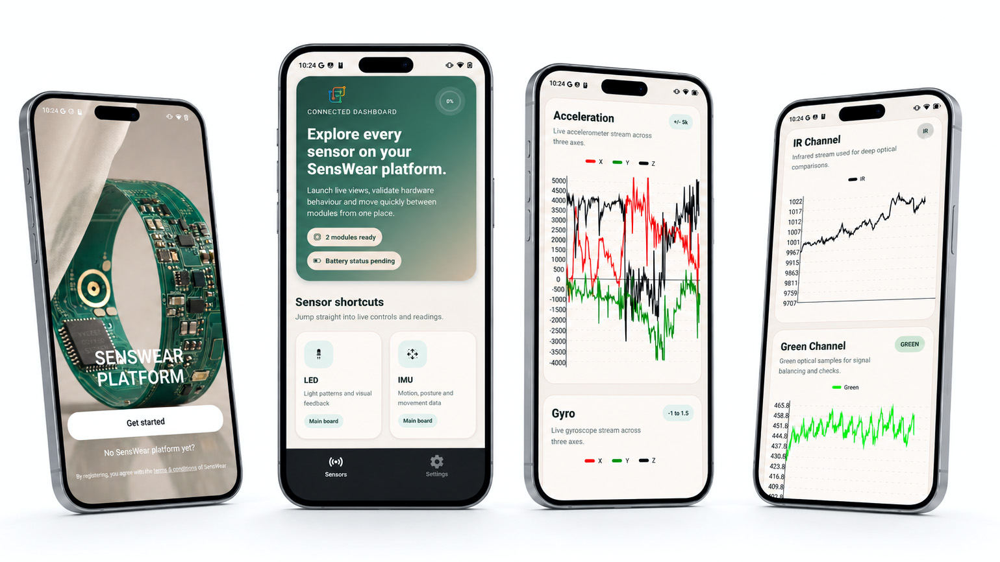

# SensWear Mobile App



Expo/React Native application for pairing with a SensWear device, inspecting live sensor
data, and controlling its LED and haptic outputs.

## Hardware features

- Battery percentage and charging state
- Quaternion and gravity-including accelerometer charts
- Red, infrared, and green raw PPG charts with CSV export
- Bluetooth Health Thermometer indications
- Live touch coordinates and normalized gestures
- RGB LED color control
- Haptic presets, intensity control, sequences, and compact Morse patterns

All Bluetooth protocol access goes through the SensWear TypeScript SDK. Screens consume typed
SDK models and do not decode base64 values or maintain UUIDs themselves.

## Requirements

- Node.js 18+
- npm
- Android Studio or Xcode for a native development build
- A SensWear device running the current firmware

`react-native-ble-plx` requires native code, so use an Expo development build rather than
Expo Go.

## Getting started

```bash
npm install
npm run android
```

For iOS:

```bash
npm run ios
```

The pairing screen requests the appropriate platform permissions and discovers devices whose
name begins with `Sens Wear`, `SensWear`, or `SenseWear`.

## SDK dependency

The app uses the official
[`senswear`](https://www.npmjs.com/package/senswear) TypeScript SDK published on npm:

```bash
npm install senswear
```

The application pins the SDK version in `package.json` and `package-lock.json` for reproducible
installs. Use `npm install senswear@<version> --save-exact` when upgrading to a newer published
release.

## Architecture

- `hooks/useBleSession.ts` owns the shared `SenswearClient`, connection state, discovery,
  persistence, and disconnect handling.
- `hooks/BleSessionProvider.tsx` exposes the session to every route.
- `app/(tabs)/sensors.tsx` shows battery/power state and routes to each hardware module.
- `app/imu`, `app/ppg`, `app/temperature`, and `app/touch` subscribe through SDK modules.
- `app/led` and `app/vibration` use SDK validation and binary encoders for writes.
- `ble/bleManager.ts` contains the one native `BleManager` passed into the SDK.

The current firmware no longer exposes the legacy daughter-board status characteristic.
While connected, the dashboard presents the SDK-supported modules; an unavailable physical
module is reported through its GATT operation.

## Validation

```bash
npx tsc --noEmit
npm run lint
npx jest --runInBand
npx expo export --platform android --output-dir dist-validation
```

Remove `dist-validation` after a local bundle check.
